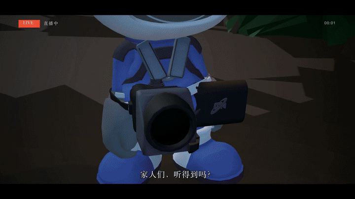

# GameDirector

**LLM is the director, not the puppeteer.**

GameDirector lets an LLM direct in-game cameras, character animation, monster
entrances, audio and pacing — producing a deterministic, version-controlled
timeline (shot list) that a playback engine executes precisely inside the game.
Use it to record trailers, PVs and machinima automatically, then verify, edit
and deliver the finished film through a reproducible pipeline.

[](https://github.com/Sttrevens/GameDirector/actions/workflows/verify.yml)
[](LICENSE)
[](global.json)
[](Directory.Build.props)

[中文文档](docs/README.zh-CN.md) · [Architecture](docs/01-architecture.md) · [DSL spec](docs/02-dsl-spec-v0.1.md) · [Directing playbook](docs/07-directing-playbook.md)



*One timeline → three shots: the cameraman robot, the monster reveal, the standoff — directed, captured and edited by the pipeline itself.

🎬 **Demo films:** [《别停机 / KEEP ROLLING》](samples/timelines/directors-cut/README.md) —
three timelines, twelve edit decisions, subtitles and score, produced end-to-end
by this pipeline — and the [CAM DOWN! animated PV](samples/timelines/camdown-pv/README.md).

## Why not just let the AI drive the editor?

Editor-automation MCPs (e.g. Unity-MCP / "AI Game Developer") let an AI
manipulate the editor in real time — great for development, but every run is
different and nothing is reproducible. GameDirector takes the opposite bet:

1. **The LLM is a director, not a puppeteer.** It works offline, producing a
   deterministic timeline asset. A playback engine executes it exactly. No
   per-frame remote control.
2. **The protocol, DSL and director agent are generic; each game contributes a
   self-describing manifest plus a thin adapter.** Portability is proven by a
   second game, not claimed.
3. **Games describe themselves.** On connect, the client pulls a capability
   manifest (actors, clips, locations, shot vocabulary, audio). The LLM
   composes only within it; the compiler falsifies everything else.
4. **Determinism first.** Same timeline + same dt sequence ⇒ same event
   sequence. Timelines can be hand-edited, LLM-generated, version-controlled
   and replayed bit-for-bit.
5. **Authority boundaries are explicit.** v0 runs offline/sandboxed (director
   mode). Networked capture is a v1 design point, not hidden behavior.
6. **Creation, judgment and execution are separated.** `IPlanGenerator`
   proposes, `IDecisionProvider` chooses among evidenced legal candidates, the
   compiler and deterministic player verify and execute. Production jobs never
   call a model.

## Install (no .NET / Python / Node required)

Grab the full standalone distribution for your platform
(`win-x64`, `osx-arm64`, `osx-x64`, `linux-x64`) from
[Releases](https://github.com/Sttrevens/GameDirector/releases) and unpack:

```text
gd doctor                        # environment + media capability check
gd unity install --project <Unity project>   # plan-only; add --apply to write
gd workbench --open true         # the standalone director window
gd mcp                           # stdio MCP server for any LLM host
gd media status                  # FFmpeg/ffprobe status + installer
```

Everything is published self-contained with SHA-256 manifests; installers are
plan-only by default, idempotent on repeat, and refuse to overwrite local
edits. [Full distribution contract](docs/16-distribution-and-install.md).

**Unity:** import the per-platform `com.gamedirector.unity-<version>-<rid>.tgz`
(Add package from tarball). The bundle carries the complete offline workbench
runtime and a CJK subtitle font — Unity needs no SDK and no network. Then
**Tools → GameDirector → Create Independent Example** gives you a self-contained
film with characters, animation, audio and three shots to try immediately.

**MCP hosts:** point your host at the packaged server:

```json
{ "mcpServers": { "gamedirector": { "command": "<dist>/mcp/gamedirector-mcp" } } }
```

Agent operating instructions ship with the package at
[`skills/gamedirector/SKILL.md`](skills/gamedirector/SKILL.md).

## Quickstart from source (no Unity needed to verify the kernel)

```bash
dotnet test                                    # kernel unit tests
dotnet run --project src/GameDirector.Cli -- \
  validate samples/timelines/pv_grimforest_demo.json \
  --manifest adapters/cdrebirth/manifests/cdrebirth.manifest.json
dotnet run --project src/GameDirector.Cli -- grammar   # DSL cheat sheet
```

With a game connected (Editor in play mode, sandbox scene):

```bash
dotnet run --project src/GameDirector.Cli -- manifest --endpoint http://127.0.0.1:39777
dotnet run --project src/GameDirector.Cli -- play samples/timelines/pv_grimforest_demo.json
dotnet run --project src/GameDirector.Cli -- capture --out captures/frame.png
```

## Production workflow

Repeatable frame-stepped takes plus a game-neutral edit renderer:

```bash
gd take timeline.json --out captures/edit/take-001 --fps 24 --width 1280 --height 720
gd edit edit.json --out captures/edit/cut-001
```

Each take writes its source timeline, live manifest, numbered frames,
event/visibility receipts, `picture.mp4` and a verified `take.json` with
source/media hashes. Edit plans render graded H.264 segments that concatenate
without audio priming; output contains `final.mp4`, a contact sheet and
`delivery.json`. Interrupted takes resume safely. See
[docs/05-production-contract.md](docs/05-production-contract.md).

Video requires FFmpeg with `libx264` (+ `libass` for captioned edits) and
ffprobe; `gd media status` checks the whole contract and offers installers.

## Layers

| Layer | Contents | Where | Generality |
|---|---|---|---|
| L0 transport | In-engine bridge (HTTP JSON-RPC), out-of-process MCP server / CLI | `packages/com.gamedirector.unity`, `src/GameDirector.Mcp`, `src/GameDirector.Cli` | engine-level generic |
| L1 director DSL | Shot language + timeline primitives + compiler + deterministic player | `src/GameDirector.Core` (zero-dependency netstandard2.1) | fully generic |
| L2 capability manifest | Game self-description: roles / actors+clips / locations / audio / shotTypes | `adapters/*/manifests/*.json` + runtime endpoint | mechanism generic, content per game |
| L3 game adapter | DSL → concrete engine/game calls | `packages/com.gamedirector.unity` (generic base) + `adapters/cdrebirth` (first instance) | one thin layer per game |

## Repo map

```
src/GameDirector.Core        # DSL model, manifest model, timeline compiler, deterministic player (zero-dep)
src/GameDirector.Client      # JSON + game-bridge HTTP client (net8, shared by CLI/MCP)
src/GameDirector.Decisions   # finite-candidate decision protocol, evidence & audit models
src/GameDirector.Cli         # gd: validate / play / stop / status / manifest / capture / take / edit / grammar
src/GameDirector.Mcp         # MCP server (stdio) exposing the same capabilities to any LLM host
src/GameDirector.Workbench   # standalone director window, model API access, persistent film jobs
src/GameDirector.Core.Tests  # compiler & player unit tests + sample asset regression guard
packages/com.gamedirector.unity  # Unity bridge: HttpListener service, shot interpreter, frame capture
packages/gamedirector-three  # Three.js interpreter (second engine path)
adapters/                    # per-game manifests + adapter skeletons (cdrebirth, sandring)
samples/timelines            # hand-authored shot lists for tests and demos
docs                         # architecture / DSL spec / adapter plans / roadmap
tools                        # release packaging, installer, contract tests
```

## Status — 0.2.0-alpha.1

- ✅ Kernel + tests + CLI/MCP + Unity bridge; first on-set capture in a real
  co-op roguelite (24 s timeline, event stream matching compiled output).
- ✅ Verified take/edit/delivery pipeline with hash receipts, resume and
  reshoot; standalone Workbench (alpha) with asset discovery, offline staging,
  multi-shot rough cuts, subtitles and directed revisions.
- ✅ Windows validation on Unity 2022.3.34f1 (sound, CJK subtitles, version
  conflicts, partial reshoot); historical macOS validation for Unity and
  Three.js paths.
- ⏳ Not yet: TTS, lip-sync, UE/Godot plugins; macOS/Linux re-validation of the
  new release pipeline; public release acceptance. Second full game
  integration is the open generality proof.

Honest limits and capability boundaries:
[docs/09-product-workbench.md](docs/09-product-workbench.md) ·
[Roadmap](docs/04-roadmap.md)

## Contributing

Contributions welcome — especially **second-game adapters** (the architecture
is built for them: one manifest + one thin layer), new shot types, and
Godot/UE exploration. See [CONTRIBUTING.md](CONTRIBUTING.md).

## License

[MIT](LICENSE) © 2026 Sttrevens
