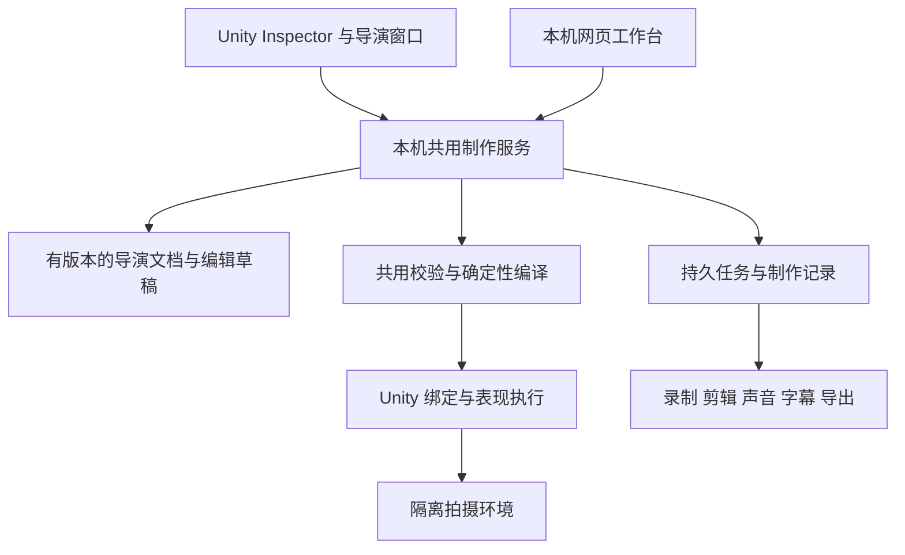

# GameDirector Unity 首版：工程借鉴与产品交付设计

日期：2026-09-12。本文交付工程评估和发布设计，不代表下列缺口已经修复或产品已经发布。

## 结论与首版承诺

首版定位为 **Unity 游戏演出与宣传片制作工具**：用已有角色、动作和场景，编排表演与镜头，预览、修改并导出有声影片。Unity Inspector 与本机网页是同一产品的两个操作入口。

这次按“用户自行安装 Unity 插件及本机工作台后，不需开发者现场配置即可完成制作”设计分享路径。公网网页直连用户 Unity 如有需要，应另行明确；现有本地服务不能直接作为公网部署方案。

成熟的验收对象是用户完整任务：安装 → 示例出片 → 换自己的资产 → 知道哪些可用 → 编排与预览 → 修改 → 导出 → 中断后恢复。支持范围应精确且兑现，不能把“任意资产都能自动表演”作为首版承诺。

保留当前 Core、编译器、Unity 适配层、生产任务和媒体输出。主要工作是补齐安装、Unity 原生创作对象、共用编辑契约、准备状态与可重复发布；无需先重写为多引擎平台。

## 本次证据范围

- CwcMontage：只读检出 `1291af7f93317a2c167d20e07459da11ccd6a7e9`，阅读 Runtime、Editor、包元数据、Demo、指南和工作流。未在 Unity 导入、运行或测量性能。
- GameDirector：`main`，HEAD `0d8064b49ff8d0f511feaa30feaebb493533a052` **加当前大量未提交实现**。不能用该 HEAD 单独复现本次被评估版本。保留原有工作区。
- 本轮重新构建完整 .NET solution：0 warning、0 error；重新运行 .NET 测试：40 passed、0 failed、0 skipped。[测试结果](../src/GameDirector.Core.Tests/TestResults/product-review-20260912.trx)。这不包含 Unity 程序集编译或运行。
- 本轮重新执行现有工作台检查：22 项通过，覆盖去重、来源变化、停止/恢复、局部镜头复用、声音字幕及输出隔离。[结果](../captures/workbench-contract-tests/f13b4e09bcf3/result.json)。使用真实 FFmpeg、模拟引擎和模拟模型提供方，不是 Unity 或真实模型服务验收。
- 独立本机工作台实例、两个 HTTP 客户端复现草稿覆盖：A 保存后，持有旧稿的 B 保存仍为 HTTP 200，A 的修改消失。[复现结果](../captures/product-review-20260912/draft-d2dc53dd/result.json)。未连接游戏或模型。
- 旧报告中的 Unity 测试、R3 包、真实影片属于历史证据，本轮未复跑，不能充当本次干净机器或真人验收。

## CwcMontage 值得借鉴的部分

| 观察到的设计 | 对 GameDirector 的具体借鉴 |
| --- | --- |
| 定位聚焦表现层，玩法系统保留决策权，Root Motion 通过接口交给外部处理 | 导演编排可执行的表现，适配器负责资产绑定与呈现接管；游戏规则、联机权威不进入通用导演内核 |
| `MontageSequenceSO` 是用户能创建、保存和选择的资产；Inspector 可直接打开专用编辑器 | 提供明确的导演创作资产，选中即可看角色绑定、镜头、校验和制作状态；用户不应先理解 HTTP 桥和 JSON |
| Runtime、Editor、Demo 分程序集，包根目录有 UPM 元数据、零声明包依赖 | 分开运行支持、编辑工具和可选示例；保证安装核心包不依赖我们的游戏工程或工作站 |
| 专用时间轴、模型视口、拖拽操作；预览资源有显式清理入口 | 用户改一个参数就能观察变化；关闭窗口、切场景和退出播放时，预览借用的资源必须归还 |
| `MontageHandle` 用槽位与代际身份判断一次播放是否仍有效 | 为引擎连接、预览会话和生产任务使用明确身份；旧窗口、旧响应不能控制新会话 |
| 扩展动作块有进入、更新、退出边界；时间跨过整个区间时有处理路径 | 扩展表演能力要同时说明准备、推进、终止、恢复与来源身份；可执行和可清理一起成立 |
| Demo、动图、中英 README、快速上手、API 和扩展教程相互引流 | 分享入口先展示真实结果，再给安装与首个成功步骤；开发者文档放到进阶路径 |

源码：[资产与 Inspector](https://github.com/CwcbbChao/CwcMontage/blob/1291af7f93317a2c167d20e07459da11ccd6a7e9/Editor/Core/MontageSequenceSOEditor.cs)、[运行句柄](https://github.com/CwcbbChao/CwcMontage/blob/1291af7f93317a2c167d20e07459da11ccd6a7e9/Runtime/Engine/MontageHandle.cs)、[预览资源管理](https://github.com/CwcbbChao/CwcMontage/blob/1291af7f93317a2c167d20e07459da11ccd6a7e9/Editor/UI/MontagePreviewViewportElement.cs)、[包描述](https://github.com/CwcbbChao/CwcMontage/blob/1291af7f93317a2c167d20e07459da11ccd6a7e9/package.json)。

不能直接照搬的部分：

1. **文档也要运行验收。** 当前快速上手调用 `Play(..., crossFadeDuration: ...)`，实际参数名是 `customBlendInTime`；示例订阅 `handle.OnCompleted`，当前句柄未定义这个事件，协调器提供 `OnMontageEnded`。按这份指南直接复制会出现 API 不匹配。这是源码对照结论，未运行 Unity 编译。我们的示例应来自随包参与编译和冒烟测试的真实代码。
2. 本次检出的仓库未发现测试套件，工作流只有文档部署；查询 GitHub Releases 返回空列表。README 的“零 GC”“绝不漏事件”等表述没有在本次得到性能或故障测试证明。它适合作为设计参考，不能作为已经彻底成熟的质量基准。
3. 包声明 `samples: []`，Demo 随主体目录提供。我们宜采用可选示例导入，并确保安装后的文档路径与实际路径一致。
4. 本项目采用 source-available 自定义许可，明确限制将其源码或修改版本作为开发工具向第三方分发。本轮仅研究设计；如要把具体代码或资源带入 GameDirector 发行包，需另获覆盖该用途的授权。[许可证原文](https://github.com/CwcbbChao/CwcMontage/blob/1291af7f93317a2c167d20e07459da11ccd6a7e9/LICENSE)。

文档/API 对照：[快速上手](https://github.com/CwcbbChao/CwcMontage/blob/1291af7f93317a2c167d20e07459da11ccd6a7e9/docs/guide/getting-started.md#L80-L95)、[实际 Play 定义](https://github.com/CwcbbChao/CwcMontage/blob/1291af7f93317a2c167d20e07459da11ccd6a7e9/Runtime/Engine/MontageCoordinator.cs#L286-L289)。

## 当前最影响分享的缺口

| 优先级 | 用户会遇到什么 | 当前依据 | 最小完整修复 |
| --- | --- | --- | --- |
| P0 | 安装插件后仍不知道怎么启动，缺外部工具时打不开或出不了片 | `tools/package_release.py:8` 为依赖外部运行时的发布；安装说明要求 .NET/ASP.NET Core、Python 和 FFmpeg；Unity 窗口只连接既有服务 | 提供固定版本 UPM 包与匹配的本机运行组件，Unity 内检测、安装或定位、启动、检查并连接；正常路径不要求用户敲命令或填端口 |
| P0 | 想在 Inspector 改导演内容，实际只有资产扫描和调度窗口 | `DirectorWorkbenchWindow.cs:15` 是 EditorWindow；Unity 包中未发现导演资产的 CustomEditor/CreateAssetMenu | 增加导演资产及 Inspector 编辑入口；角色、镜头参数、预检、预览、制作与记录均接入共用服务 |
| P0 | 两个窗口先后保存，旧稿覆盖新稿；响应丢失后再次点击可能重复制作 | `Program.cs:53-54` 草稿直接覆盖，无 revision 条件；`app.js:17,54` 每次动作生成新的 requestId | 草稿提交带 expectedRevision；冲突显式保留本地内容；一次用户意图持有稳定操作 ID，未知结果先查状态再重试 |
| P0 | 演示依赖原作者游戏资产、现场场景准备或模型配置，第一次无法成功 | 发行脚本带游戏专用包与配方；Unity 包未声明可导入的独立导演示例 | 随包提供合法可分发的独立 Unity 示例、预绑定资产、可编辑导演稿、声音和预期影片；首个成功不依赖模型服务 |
| P1 | 能扫到模型，却不能执行所需动作；直到录制或生成后才发现缺能力 | 现有资产发现与真实 manifest 已区分，但缺少一份覆盖全流程的结构化准备报告 | 按用户选择的操作汇总缺失绑定、版本、引擎状态、媒体工具、存储和模型条件；每项给可定位的原因与修复操作 |
| P1 | 用户填了兼容 API，却因参数不兼容失败，重启还要重新配置 | `ApiDirector.cs:17,54` 仅内存配置，固定 Chat Completions 参数与 JSON 模式 | 首版固定少量经过真实调用验证的配置，显示连接检测；可选 OS 安全存储；未知提供方进入高级设置，不宣传普遍兼容 |
| P1 | 多个 Unity 工程或升级后连接错误，旧状态看似仍可用 | 窗口固定初始端口；服务无完整版本握手；ProjectId 当前从绝对工程路径派生 | 区分工程 ID、工程位置和引擎会话 ID；发现实际服务地址；协商包/协议/文档/能力版本，旧会话回执失效 |
| P1 | 分享内容与首版承诺矛盾 | 网页默认 Three.js/Sandring，发行包混合 Three 与游戏专用适配；包名称为 Bridge，描述面向实现 | 首版 UI、默认示例、下载包、README 全部以 Unity 用户任务组织；其他已有实现保留为独立开发内容 |

现有优点应该继续使用：单一任务服务、请求去重、原子文件写入、来源哈希与逐镜头复用、重启后的中断状态、源工程输出隔离、媒体结构校验、安装时的文件归属和本地修改保护。首版工作不应把它们推倒重做。

## 底层责任：一个产品、两种界面

这沿用当前 `Studio` 的单一服务和串行执行设计，不增加一套云后台或每端各自的任务系统。

### 创作资产、编辑草稿与制作结果

- **导演文档**使用稳定 ID、schema 版本、revision、父版本以及资产引用。工程移动不改变文档身份；Unity 资源身份沿用 GUID + local file ID，来源哈希用于判断修改，不代替身份。
- **当前编辑草稿**由共用服务作为唯一写入者保存。Inspector、网页和 Agent 都提交相同的带 expectedRevision 命令，接受相同校验，读取同一 revision。旧版本保存返回冲突及最新版本，保留用户未提交内容。
- **Unity 导演资产**保存用户明确保存的创作版本和资源绑定，是版本管理及再次导入的载体。它与工作台草稿有明确的“已保存/有未保存修改/外部资产已改变”状态；导入或应用前核对 baseRevision 和来源哈希，不做无条件双向同步。
- **Unity Undo**只撤销创作编辑，形成对旧字段值的新修订；不回滚已经启动的模型调用或制作任务。外部已修改同一内容时先处理版本冲突。
- **制作任务**引用不可变文档快照、源资产指纹、媒体 ID 与输出参数。之后修改草稿不改变正在执行的影片。只有来源相符且校验过的镜头可以复用。
- **声音与输出**留在工作台生产目录。分享可复现工程时打包配方、被许可的依赖和声音，以及依赖清单；只导出 JSON 不应被描述为完整工程分享。Unity 资产引用缺失时给映射界面，不能静默替换。

### 两个界面的分工

| Unity Inspector 与导演窗口 | 本机网页 |
| --- | --- |
| 创建/选择导演资产，直接拖入角色、动作、机位 | 大画布排列镜头、修改导演意图 |
| 在工程中定位缺失资源与绑定 | 比较不同修订和成片 |
| 调整当前镜头并预览 | 管理较长的音轨、字幕和批次记录 |
| 查看准备状态，开始、取消和恢复制作 | 使用同样的准备状态和任务操作 |
| 保存明确的创作版本，支持 Undo | 将修改作为同一文档的新 revision 提交 |

核心闭环可从任一入口完成；布局不必逐像素一致。Inspector 不应只是跳网页按钮，网页也不应拥有一套不同的校验规则。

### 执行与恢复

沿用现有 Queued、Running、Verified、Failed、Interrupted、Cancelled 任务状态；增加有结构的阶段、错误和可用恢复动作即可。`Verified` 表示输出的技术检查通过，用户界面仍应显示待审片。

命令至少带文档 revision、稳定 requestId、目标工程/会话身份。刷新、断线、Editor 编译或 Play Mode 重启都不改变一次既有操作的身份。对于结果不明的超时，先查询已保存的任务，再决定是否提交；新用户意图才生成新的 ID。

预览与正式录制使用同一编译结果和呈现契约，区别放在分辨率、输出范围及质量参数。正式录制需要的 Play Mode 状态应由产品明确解释和引导。任意时间跳转只对可重建的表演开放；复杂模拟沿用从起点重演恢复，不假设能随意 seek。

游戏适配器承担视觉组件准备、推进、结束和还原。现有 `IDirectorPresentationParticipant` 是扩展基础；不能靠游戏名特判，也不能因发现一个 Animator 就宣称脚本表情、IK 或程序动画已兼容。

### 准备状态应服务具体操作

统一预检返回：检查项、通过/需处理/不适用、原因、关联角色或镜头、用户可执行的修复动作。UI 根据该结果引导下一步。

- 浏览和编辑不要求模型 API 或编码器可用。
- 示例和手动制作不要求模型 API。
- 生成导演稿检查模型配置及真实调用支持，先于昂贵制作。
- 预览/导出检查对应的引擎、角色绑定、编码能力、字幕字体及输出空间。
- 未开 Unity、正在编译、未准备拍摄环境、端口被占用、版本不匹配需要不同提示。
- 资源“已发现”“已绑定”“当前可执行”“需要项目适配”分开显示，不能用一个绿色连接状态概括。

## 分享出去的实际包装

1. **固定版本安装入口。** 下载页写明目标用户、真实片段、支持环境和当前版本。Unity UPM 包可使用固定 tag/commit 或包文件；不依赖使用者读取我们的整个私有仓库。
2. **匹配的本机运行组件。** 按声明支持的平台打包独立运行的工作台与所需媒体组件。Unity 负责发现和启动，组件更新可校验、可回退。涉及二进制与字体的分发，随发布物带对应许可与来源。签名、安装权限和系统拦截须按目标系统实测。
3. **可直接运行的示例。** 建议目标为安装后 5 分钟内得到一段 10–15 秒、三镜头、有声有字幕的示例；再替换主角、改一个镜头并导出。时间是拟定验收指标，不是当前实测结果。
4. **用户文档与支持。** 第一页只写从安装到第一支影片的步骤；常见失败配具体恢复动作。进阶才进入 DSL、MCP、定制适配。诊断包由用户主动导出，包含版本、状态、脱敏日志和任务号，不默认附源资产或密钥。
5. **一致的发布物。** 包版本、工作台版本、协议版本、示例、文档和测试记录指向同一候选。当前 dirty 工作区要先按归属整理成可复现版本，再产生对外候选；不能将本轮测试结果只绑定到旧 HEAD。

首版不必扩张到 UE/Godot、联机导演或自动口型。现有 Three 实现可继续维护，但不应让 Unity 用户首屏先选择 Three.js 或使用 Sandring 专有角色名。

## 按依赖顺序落地

| 顺序 | 完成内容 | 验收条件 |
| --- | --- | --- |
| 1 | 有版本导演文档、共用命令、稳定重试身份、连接会话与准备报告 | 两个客户端同时编辑不丢修改；响应丢失不重复执行；旧连接不能修改新会话；不可用能力在操作前给准确原因 |
| 2 | 固定版本本机组件、Unity 引导入口、独立可分发示例 | 无开发 SDK 的新用户安装后能启动、导入示例、首次出片；不用现场配置端口或执行脚本 |
| 3 | Unity 导演资产/Inspector，网页围绕同一文档完善 | 任一入口编辑、预览、制作、取消、恢复；另一入口看到相同内容和状态；保存、Undo、外部修改有明确规则 |
| 4 | 固定支持矩阵、发布物、文档示例验证和外部试用 | 同一候选在声明的系统/Unity/渲染管线组合通过；陌生用户独立完成，实际失败反馈闭环 |

## 发布前必须拿到的证据

- **干净安装**：至少覆盖每一个对外声明支持的 OS/CPU、Unity 版本、渲染管线组合。没有覆盖的组合不打已支持标识。Unity 2022.3 是当前候选基线；Unity 6、URP/HDRP 等需分别纳入真实测试后再承诺。
- **首次成功**：从下载页到完整示例影片的无陪同录屏；记录耗时、求助次数和失败原因。不能以开发机已有依赖代替。
- **真实接入**：除 CDREBIRTH 外，至少一个结构不同的真实 Unity 游戏，包含自己的角色和表现脚本。空白工程胶囊测试负责技术行为，不代替真实项目接入成本。
- **两端一致**：同时编辑、过期保存、断网重连、Unity 重新编译、多工程切换、重复点击、升级后的旧文档恢复。
- **生产失败**：录制中断、退出 Play Mode、编码失败、磁盘不足、模型超时。任务保留已完成工作，恢复动作有明确前提，源场景不被擅自保存。
- **升级与卸载**：升级保留创作资产、本地修改和历史成片；卸载不会移除用户作品；降级时清楚说明新格式是否可读。
- **真人试用**：建议先让 3 位未参与开发者各完成一次示例制作及自有资产替换。自动测试与真人验收分别记录，不能互相代替。

发布成功的标准是这些证据绑定到同一个可下载候选，而不是功能列表长度、窗口数量或“1.0”版本号。
